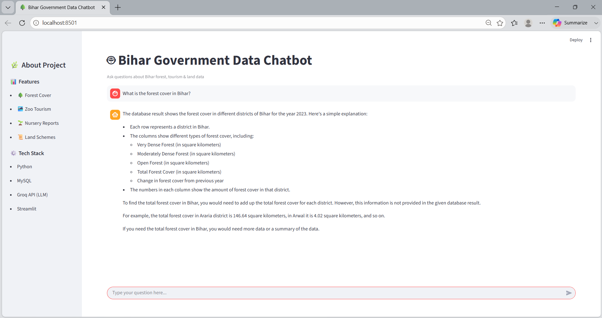
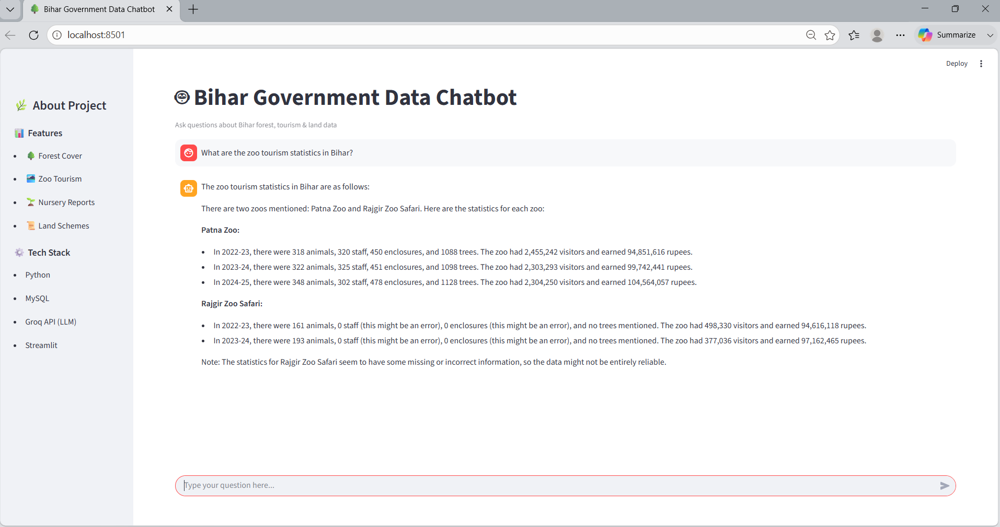
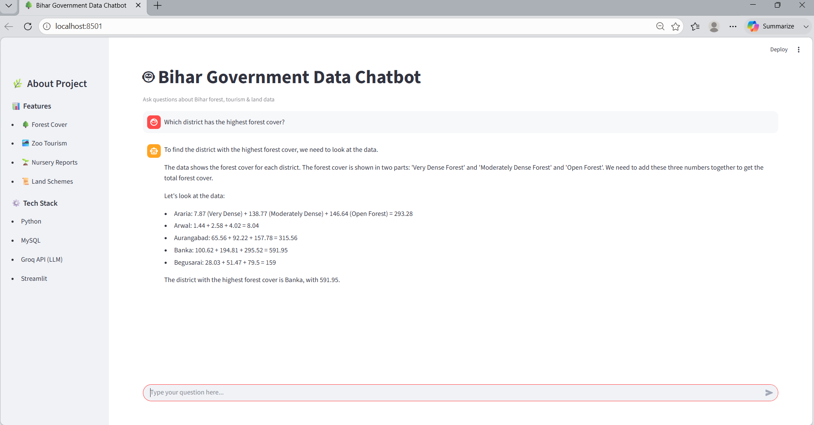
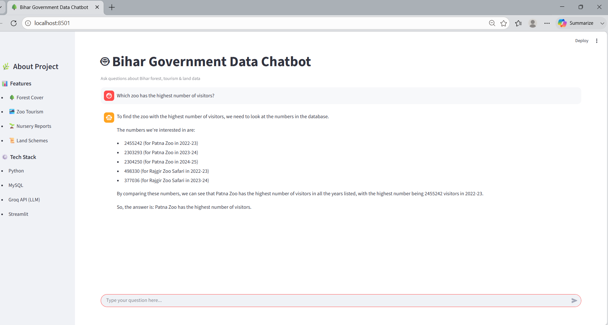
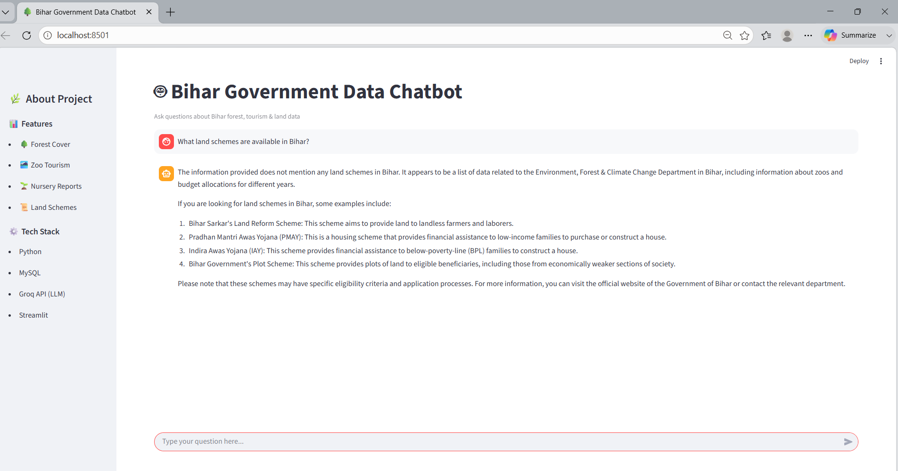

#  Bihar Government Data Chatbot

An AI-powered chatbot that answers user queries using Bihar government datasets.  
It converts natural language questions into SQL queries, fetches data from the database, and generates meaningful responses using LLM.

---

##  Features
- Natural language to SQL conversion  
- Real-time database querying  
- AI-based response generation using LLM  
- Clean and interactive Streamlit UI  
- Supports multiple domains (forest, tourism, land schemes)  

---

##  Tech Stack
- Python  
- MySQL  
- Groq API (LLaMA 3)  
- Streamlit  

---

## ▶️ Setup & Run

```bash
pip install -r requirements.txt
streamlit run streamlit_app.py
```

##  Screenshots

###  Forest Cover Analysis
User asked about forest cover in Bihar and chatbot provided structured explanation with district-wise data.


---

###  Tourism Statistics
Chatbot answered tourism-related query and displayed visitor statistics for different zoos.


---

###  Highest Forest District
Query to identify district with highest forest cover, chatbot performed comparison and gave result.


---

###  Zoo Visitors Analysis
User asked which zoo has highest visitors, chatbot analyzed dataset and provided correct answer.


---

###  Government Land Schemes
Chatbot explained various land schemes and their purpose in Bihar.



### Example Questions
What is the forest cover in Bihar?
Which district has the highest forest cover?
What are the tourism statistics in Bihar?
Which zoo has the highest number of visitors?
What land schemes are available in Bihar?

### Project Highlights
Efficient data retrieval using SQL queries
Fast response generation using Groq API
User-friendly chatbot interface
Handles multiple government data domains